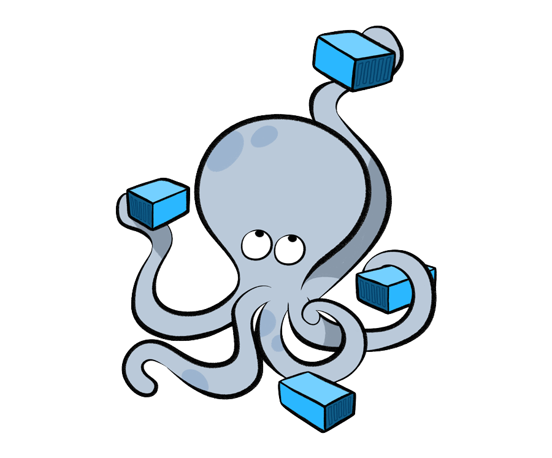

# Docker Compose Labs Overview

---

### Preface

- `Docker Compose` is a tool for defining and running multi-container `Docker` applications
- With `Docker Compose`, you use a `YAML` file to configure your application's services
- Then, with a single command, you can create and start all the services from your configuration
- `Docker Compose` simplifies the development, testing, and deployment of complex applications

---

## Docker Compose Overview

- `Docker Compose` allows you to **define multiple services** in a single `YAML` file
- Services can be **linked together** through networks and dependencies
- `Docker Compose` manages the **entire application lifecycle**

---

### Key Benefits

- **Simplified Multi-Container Management**: Define and run multiple containers with a single command
- **Environment Consistency**: Ensure the same environment across development, testing and production
- **Service Dependencies**: Control the startup order and dependencies between services
- **Network Isolation**: Create isolated networks for your application components
- **Volume Management**: Persist data and share files between containers and the host

---

### Docker Compose File Structure

- A `docker-compose.yml` file defines your application's services, networks, and volumes
- **Services**: Define the containers that make up your application
- **Networks**: Create custom networks for service communication
- **Volumes**: Manage data persistence and sharing

### Core Concepts

#### `version`

- Specifies the Compose file format version
- Different versions support different features
- Latest version provides the most features and compatibility

#### `services`

- The main section where you define your application containers
- Each service represents a single container
- Services can be built from `Dockerfiles` or use existing images

#### `networks`

- Define custom networks for service communication
- Services on the same network can communicate using service names
- Provides isolation between different application components

#### `volumes`

- Define named volumes for data persistence
- Share data between containers
- Persist data beyond container lifecycle

---

## 📚 Available Labs

### <a href="/DockerComposeLabs/001-intro/" target="_blank">001 - Introduction</a>

**Introduction to `Docker Compose`**

This lab provides a comprehensive introduction to `Docker Compose`, a tool for defining and running multi-container Docker applications. You will learn the fundamentals of `Docker Compose` and how to set it up on different operating systems.

**What You will Learn:**

- What `Docker Compose` is, and what are its benefits
- How to install `Docker Compose` on different platforms
- Basic concepts of multi-container orchestration

### <a href="/DockerComposeLabs/002-Compose-Demo/" target="_blank">002 - Compose Demo</a>

**Multi-Container Application Demo**

This lab demonstrates a practical `Docker Compose` example with a multi-container application. You will explore a complete `docker-compose-sample.yml` file that defines three inter-connected services:

1. a web server
2. an application
3. a database

**What You will Learn:**

- Basic `docker-compose.yml` file structure
- Multi-service application configuration
- Web server, application, and database integration

### <a href="/DockerComposeLabs/003-Structure/" target="_blank">003 - Structure</a>

**Complete `Docker Compose` Structure Guide**

This comprehensive lab covers the complete structure and syntax of `Docker Compose` files. You will learn about all the major configuration options, from basic service definitions to advanced features like: health checks, networks and volumes.

**What You will Learn:**

- Detailed `docker-compose.yml` structure
- Common service configurations
- Best practices for service definition

### <a href="/DockerComposeLabs/004-Commands/" target="_blank">004 - Commands</a>

**Essential `Docker Compose` CLI (Command Line Interface) Reference**

This lab provides a comprehensive guide to the `Docker Compose` command-line interface. You will master all the essential commands needed to manage multi-container applications effectively, from basic startup and shutdown to advanced debugging and maintenance operations.

**What You will Learn:**

- Essential `Docker Compose` commands
- Managing application lifecycle
- Debugging and troubleshooting

### <a href="/DockerComposeLabs/005-Compose-2Helm/" target="_blank">005 - Compose to Helm</a>

**Creating and Using Helm Charts**

Helm is a powerful package manager for Kubernetes that simplifies the deployment and management of applications. This lab will walk you through the process of creating and using a Helm chart as well as converting `Docker Compose` configurations to Kubernetes deployments.

**What You will Learn:**

- Converting `Docker Compose` to Helm charts
- Kubernetes deployment strategies
- Migration from development to production

### <a href="/DockerComposeLabs/006-Compose-Advanced/" target="_blank">006 - Compose Advanced</a>

**Advanced `Docker Compose` Configuration**

This lab demonstrates advanced `Docker Compose` features, including the `extends` functionality, `YAML anchors`, and modular service definitions for a complete monitoring stack with `Grafana`, `Loki`, `Prometheus` and more.

**What You will Learn:**

- Advanced `Docker Compose` features
- Complex service configurations
- Production-ready setups with monitoring

### <a href="/DockerComposeLabs/007-Watch/" target="_blank">007 - Watch</a>

**`Docker Compose` Watch Feature**

`Docker Compose Watch` is a powerful tool for monitoring changes in your `Docker Compose` setup and automatically rebuilding or restarting services when changes are detected. This lab demonstrates how to implement and use `Docker Compose Watch` for streamlined development workflows.

**What You will Learn:**

- `Docker Compose Watch` feature
- Live reload and development workflows
- File synchronization and hot reloading

### <a href="/DockerComposeLabs/008-Networks/" target="_blank">008 - Networks</a>

**Multi-Network Architecture**

This lab showcases a production-like microservices architecture with proper network segmentation, security boundaries, and service isolation. The example includes 8 different networks, each serving specific purposes and demonstrating various networking patterns used in enterprise applications.

**What You will Learn:**

- Advanced multi-network architecture
- Network segmentation and security
- Service discovery and isolation patterns
- DMZ and monitoring network configurations

---

## Additional Features

### Docker Compose Watch

- Automatic file synchronization
- Live reload capabilities
- Enhanced development experience
- Real-time updates without rebuilding

### Service Orchestration

- Health checks and dependency management
- Scaling services up or down
- Load balancing and service discovery
- Rolling updates and zero-downtime deployments

### Production Considerations

- Security best practices
- Performance optimization
- Monitoring and logging
- Backup and recovery strategies

---

## 🚀 Getting Started

Each lab is self-contained and includes:

- Hands-on exercises
 Start with <a href="/DockerComposeLabs/Labs/index.md" target="_blank"><strong>Start Here</strong></a>

While the labs can be practiced using your local Docker environment, it is recommended to use a cloud-based solution like <b>Google Cloud Shell</b>, in which Docker and Docker Compose are pre-installed and ready to use. 

## Resources

The `resources` directory contains:

- Configuration files for various services
- Sample YAML files for different scenarios
- Supporting materials and documentation
- Server application examples

---

## Support

- Each lab is self-contained with detailed explanations
- Common issues and solutions are documented
- Best practices and tips are included throughout
- Real-world examples and use cases provided

## 📖 Documentaion and reference

- <a href="https://docs.docker.com/compose/" target="_blank">Docker Compose Documentation</a>
- <a href="https://hub.docker.com/" target="_blank">Docker Hub</a>
- <a href="https://kubernetes.io/docs/" target="_blank">Kubernetes Documentation</a>

---

**Happy Learning!**
   

